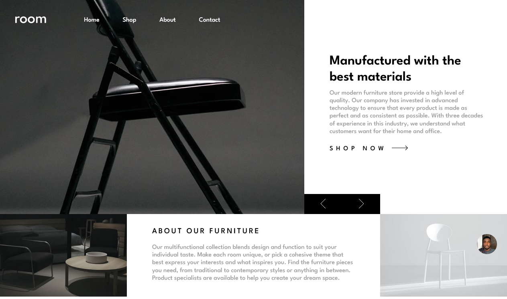

# Frontend Mentor - Room homepage solution

This is a solution to the [Room homepage challenge on Frontend Mentor](https://www.frontendmentor.io/challenges/room-homepage-BtdBY_ENq). Frontend Mentor challenges help you improve your coding skills by building realistic projects. 

## Table of contents

- [Overview](#overview)
  - [The challenge](#the-challenge)
  - [Screenshot](#screenshot)
  - [Links](#links)

  - [Built with](#built-with)
  - [What I learned](#what-i-learned)
  - [Continued development](#continued-development)

- [Author](#author)


**Note: Delete this note and update the table of contents based on what sections you keep.**

## Overview

### The challenge

Users should be able to:

- View the optimal layout for the site depending on their device's screen size
- See hover states for all interactive elements on the page
- Navigate the slider using either their mouse/trackpad or keyboard

### Screenshot



### Links

- Solution URL: [click here to see my solution](https://www.frontendmentor.io/solutions/responsive-room-ecomerce-landing-page-with-sass-and-vanilla-javascript-JkzM__koy-#comment-632ba22217bbaaaa1e7afcff)
- Live Site URL: [cick here to see the live site](https://JAjorgbor.github.io/room-home-page-frontend-mentor-challenge/)

## My process

### Built with

- Semantic HTML5 markup
- CSS custom properties
- Flexbox
- CSS Grid
- Mobile-first workflow
-Vanilla Javascript 
-SASS


### What I learned

I learnt how to create sliding carousels with vanila js and the css transform property.
To see how you can add code snippets, see below:

```html
    <div class="slides">
      <div class="cont">
      <div class="slide-pics">
        
    
    
    
    

    
    
  </div>
</div>
<div class="slide-btns">
  <button class="prev-btn"></button>
  <button class="next-btn"></button>
</div>
</div>

```
```scss
.slides{

    .cont{
        position:relative;
        max-width:100vw;
        overflow-x: hidden;
        

    .slide-pics{
        margin:auto;
        display:flex;

    }

}
}

```
```js
nextBtn.addEventListener("click",moveSlideForward);
// function to move slide forward
function moveSlideForward(e){
    if(isLarge){
        size=850;
    }
    else{
        size=375;
    }
    if(counter==pics.length-1){return;}
    slidePics.style.transition="transform 1s ease-in-out";
    counter ++;
    slidePics.style.transform=`translateX(-${counter*size}px)`;
    //
    markupTexts.forEach((markupText)=>{
        markupText.classList.remove("active-markup");
    })
    //
    if (textCounter==markupTexts.length-1){
        textCounter=-1;
    }
    textCounter++;
    markupTexts.forEach((markupText)=>{
        if(Array.from(markupTexts).indexOf(markupText)==textCounter){
            markupText.classList.add("active-markup");
        }
        
    })
}
```


### Continued development

I would like to improve my method of making the carousel slide show in a way that would be easier to make responsive in multiple screens as I ran into some issues when trying to make the slideshow and its photos fit well with smaller screen sizes.

## Author


- Frontend Mentor - [@JAjorgbor](https://www.frontendmentor.io/profile/JAjorgbor)
- Twitter - [@yourusername](https://www.twitter.com/jAjorgbor)


